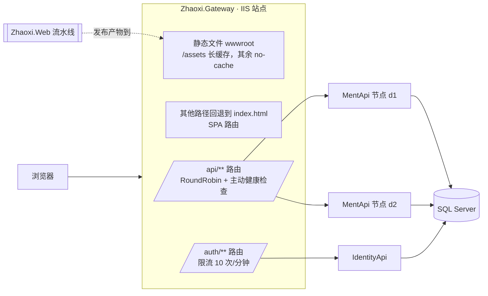
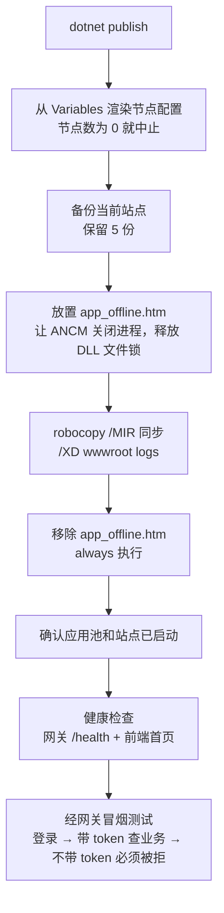

# Zhaoxi.Gateway · YARP 网关

基于 **YARP（.NET 10）** 的 API 网关，是[朝夕后台管理系统](https://github.com/liangfeng-hash/Zhaoxi.Management)在 Windows / IIS 环境下的统一入口。它一个进程同时负责：

- **托管前端**：静态文件、SPA 路由回退、按路径设置缓存策略
- **负载均衡**：`/api` 请求轮询分发到多个后端节点，主动健康检查，节点故障时自动摘除
- **登录限流**：`/auth` 固定窗口，每分钟 10 次，超出返回 429
- **部署验证**：`/gateway/info` 返回构建时间和主机名，用来确认线上跑的确实是这次发布的版本

发布记录：[Actions](https://github.com/liangfeng-hash/Zhaoxi.Gateway/actions) · 配套仓库：[Zhaoxi.Management](https://github.com/liangfeng-hash/Zhaoxi.Management)（后端）· [Zhaoxi.Web](https://github.com/liangfeng-hash/Zhaoxi.Web)（前端）

## 架构



前端请求都用相对路径（`/api`、`/auth`），和网关同源，所以前端**不需要单独建站**，不需要 CORS，也不需要 IIS URL Rewrite。

## 关键配置

```jsonc
"api-cluster": {
  "LoadBalancingPolicy": "RoundRobin",
  "HealthCheck": {
    "Active": { "Enabled": true, "Interval": "00:00:10", "Timeout": "00:00:05",
                "Policy": "ConsecutiveFailures", "Path": "/health" }
  },
  "Metadata": { "ConsecutiveFailuresHealthPolicy.Threshold": "3" },  // 连续失败 3 次就摘除
  "Destinations": { "d1": { "Address": "http://localhost:8000/" } }  // base 只放最小集
}
```

**节点列表不写死在仓库里。** `appsettings.json` 只放本机的单个节点；生产环境的节点列表存在 GitHub Environment Variables（`GW_API_DESTINATIONS`），发布时渲染成 `appsettings.Production.json`。

> 为什么 base 配置只放最小集：ASP.NET Core 的分层配置是按 key **覆盖或新增**，没有删除。base 里写了 d1 和 d2，Production 里只写 d1，d2 照样删不掉。

## 发布流水线

push 到 main 且改动了代码或配置时触发，跑在本机的 self-hosted runner 上。



### 实际踩过的坑

| 现象 | 原因 | 处理 |
| --- | --- | --- |
| 网关一发布，前端页面全没了 | `robocopy /MIR` 会把目标目录里「多余」的文件删掉，而 `wwwroot` 是前端流水线写进去的 | `/XD wwwroot`，被排除的目录既不复制也不删除 |
| 健康检查一直红，但站点其实正常 | YARP 的 `Match.Path` 只匹配不改写，`/api/health` 会原样转发到后端，而后端的 health 端点在根路径 | 网关自身探 `/health`；要验证整条链路就用冒烟测试 |
| 负载均衡悄悄退化成单节点 | 忘了放 Production 配置时不会报错，只剩 base 里那一个节点 | 节点配置由流水线渲染，并校验节点数 |
| 同步时 DLL 被占用 | 以为必须停站点 | 不用停站点。`app_offline.htm` 会让 ANCM 退出应用进程、释放文件锁，站点端口始终在监听 |
| 移除 app_offline 后站点仍然连不上 | app_offline、应用池、站点是三个独立层级，站点被手动停过时不会自动启动 | 发布步骤里显式检查应用池和站点状态，没启动就启动 |
| 冒烟测试没发现鉴权失效 | 本项目鉴权失败也返回 HTTP 200 | 判断 body 里的 `success` 字段 |

## 本地运行

```bash
dotnet run    # 默认转发到 localhost:8000（MentApi）和 localhost:8001（IdentityApi）
curl http://localhost:5201/gateway/info
```

> Linux 生产环境（linux-C）用 Nginx 承担同样的职责，见 [Zhaoxi.Management](https://github.com/liangfeng-hash/Zhaoxi.Management) 和 [Zhaoxi.Web](https://github.com/liangfeng-hash/Zhaoxi.Web)。
